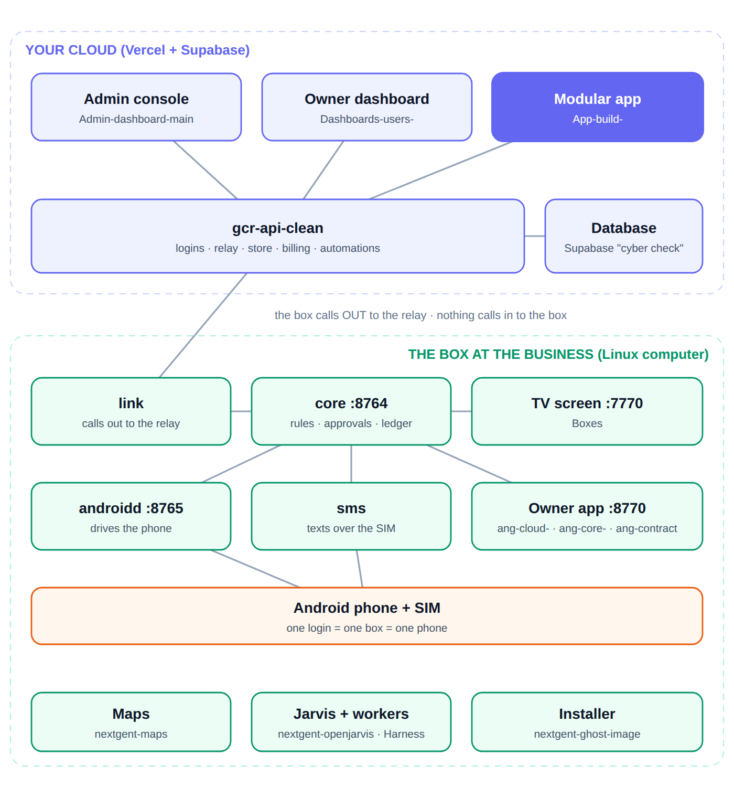

# Modular

A web app store where the apps are **containers, not code**.

A user signs up, installs the apps they need, edits them directly, and chooses
which ones the public sees. Every app is self-contained: installing, editing or
removing one cannot affect any other. The owner never touches code, hosting,
schemas or security.

**Status.** A Next.js + Supabase app with its own login. It is **not deployed**
(there is no Vercel project for it) and it needs a Supabase project, so no
screenshot is included: a real one would need a live database, and a mocked one
would show something that does not exist. Its pages are `/` , `/login`,
`/signup`, `/dashboard` (your apps), `/dashboard/build` (+ `/describe`, and
`/dashboard/build/[listingId]` to edit one app), `/dashboard/design`, `/dashboard/store`, `/dashboard/settings/ai`,
`/dashboard/apps/[installId]`, `/dashboard/ghost` (My Ghost, the second door to a
Ghost box through the same relay as the business dashboard), `/u/[handle]` and
`/u/[handle]/[slug]` (public pages) and `/preview`.

## NEXT GENT: what this repo is now

This repo is NEXT GENT's **shared app engine** and its **app builder** (plan §3, §7, §13).

- **The engine** is `packages/engine` (`@nextgent/app-engine`): the manifest validator (app-manifest v1 +
  the store's rules + an engine `ui` section), two renderers that turn (manifest, settings, data,
  actions) into blocks, a React drawer for Play-user and gcr-unified, a plain-HTML drawer for static
  public blocks, and a data adapter that only ever calls gcr-api-clean. No dependencies, no app names.
  Its README documents the manifest, the views, the block vocabulary and the gcr-api-clean routes.
- **The apps** that shipped here are converted to engine manifests in `apps/<name>/manifest.json`.
  `src/modules/*/manifest.ts` stay as the builder's starting points and the retired store's seeds.
- **The builder** (manual, describe-it, speak-it) is at `/build` with no login. It still edits the same
  draft (`src/lib/modules/derive.ts`); its output is an engine manifest
  (`src/lib/engine/from-module.ts`) to download or publish into Paperclip's store
  (`POST /api/store/admin/items`, then `/versions`).
- **Retired, switched off, not deleted:** App-build-'s own login, its own Supabase project and its own
  store (`module_listings`, `installs`, `page_templates`), with the dashboard, page studio, public pages
  and `/preview` that depend on them. Accounts are Paperclip's, business data is gcr-api-clean's, the
  store is Paperclip's. `APP_BUILD_LEGACY_PLATFORM=on` turns all of it back on exactly as before
  (`src/lib/legacy.ts`); off, those paths redirect to `/retired` (and `/dashboard/build` to `/build`),
  and the server refuses to open a Supabase client.

Checks: `npm test` (app tests + engine tests), `npm run typecheck`, `npm run lint` (ESLint CLI; `next
lint` no longer exists in Next 16), `npm run build`.

The rest of this README describes the retired platform as it was.

**One setting ties it to the rest of Ghost:** `NEXT_PUBLIC_GCR_API_BASE` (the
relay in `gcr-api-clean`), and for My Ghost to work this app must share
`gcr-api-clean`'s Supabase project (one login) with an account that owns a
business there.

It overlaps in purpose with the Store that now lives in `gcr-api-clean` (managed
from the admin console and shown in `Dashboards-users-`). The two are not
connected: apps here are `module_listings` rows in its Supabase project, the Store there is
`store_items` in `cyber check`.



*The diagram draws the Modular app in the cloud next to the API. In fact it is not
deployed, it reads and writes its own Supabase project directly
(`src/lib/supabase/`), and it calls `gcr-api-clean` only for My Ghost
(`src/components/ghost/GhostPanel.tsx`).*


<!-- branches:start -->
## Branches

*Read from GitHub on 2026-09-29. 3 branches.*

- **Default branch on GitHub:** `claude/modular-app-ecosystem-7xteeg`. It does **not** yet have this README or the audit fixes; those are on `claude/repo-code-analysis-y4n1k7`, which contains every commit of `claude/modular-app-ecosystem-7xteeg` and more, so it can be fast-forwarded without losing anything.
- **`claude/repo-code-analysis-y4n1k7`** is where the README audit, the screenshots and the fixes were made.
- Every other branch is already contained in `claude/repo-code-analysis-y4n1k7`; nothing is only on another branch.

| Branch | Last commit | Not in the work branch | Last commit message |
| --- | --- | --- | --- |
| `claude/repo-code-analysis-y4n1k7` (work branch) | 2026-09-29 | - | this README and the audit fixes |
| `claude/modular-app-ecosystem-7xteeg` (default) | 2026-08-30 | 0 | Make the AI layer modular: any provider, any account's own key |
| `main` | 2026-08-30 | 0 | Make the AI layer modular: any provider, any account's own key |

<!-- branches:end -->

## The idea in one paragraph

Most "AI builds your app" products generate a codebase per project. That makes
every app an island: they can't safely share a page, they can't interoperate,
their security can't be centrally guaranteed, and the output walks off the
platform. This project takes the opposite approach. **An app is a declaration —
a manifest — and one shared runtime renders every manifest.** A module says what
data it stores, what screens its owner gets, and what (if anything) visitors
see. It never ships executable code. That single decision is what makes the rest
possible: apps can't break each other, security is enforced once for all of
them, and an app is a small, diffable, versionable, sellable artifact.

## Nothing is hardwired

Everything the platform offers is data that users create, not code that ships:

| | Where it lives | Who can add one |
| --- | --- | --- |
| **Apps** | `module_listings` rows | anyone, from the app builder |
| **Layouts** | `page_templates` rows | anyone, from the page studio |
| **Page designs** | a theme on the profile | every owner, fully |
| **Installed apps** | `installs` rows with a pinned manifest | every owner |

The apps and layouts that ship with the platform are **seeded as ordinary
rows**. They hold no privileges: the store, the runtime and the installer treat
them exactly like something a user built, and `npm test` proves it by
round-tripping every built-in app through the builder's own data shape. If a
built-in could express something the builder cannot, that test fails.

The one thing that is code is the set of rendering primitives — thirteen field
types and ten public templates. Adding a template means writing the component
and adding it in four places: the `publicTemplateSchema` enum and
`TEMPLATE_VARIANTS` in `src/lib/modules/spec.ts`, `TEMPLATE_INFO` and
`TEMPLATE_ORDER` in `src/lib/modules/templates.ts` (which the builder reads), and
the `TEMPLATES` map in `src/components/public/PublicSurface.tsx`. The three maps
are typed as complete records, so a missing entry fails `npm run typecheck`, and
`tests/builder.test.ts` checks `TEMPLATE_ORDER`.

## Describe it, or speak it

`/dashboard/build/describe`. Type what you need, or tap the microphone and say
it — voice is transcribed entirely in the browser (the Web Speech API), so no
audio is ever sent anywhere, including to the AI provider; only the resulting
text leaves the device, exactly as if it had been typed.

The model never writes code or markup. It fills in the same handful of choices
the manual builder asks a person to make — name, fields, whether there's a
public face — returned as one structured object. That gets checked twice
before anything is saved:

1. **Schema check.** The response is required to match `AiDraft`, whose field
   types and templates *are* the platform's own `fieldTypeSchema` and
   `publicTemplateSchema` — not a hand-copied list, so they cannot drift apart.
2. **Manifest validation.** The result is converted into the same `ModuleDraft`
   the manual builder edits and run through the identical `validateDraft` gate
   every module passes through. The AI has no shortcut around it.

Accepting a proposal drops the user into the same manual builder from a normal
click-through creation, fully editable, so a bad guess by the model is never a
dead end. Refining is conversational: each follow-up sends the current draft
back to the model with the new instruction and gets a patched proposal.

### Any AI, not one AI

Generation goes through the [Vercel AI SDK](https://github.com/vercel/ai)
rather than a provider's own SDK, which is what makes the rest of this
possible with one code path instead of five. `resolveModel()`
(`src/lib/ai/resolve-model.ts`) turns a provider choice into the SDK's
one uniform `LanguageModel` type; everything past that point — the prompt, the
schema, the validation, the rate limiting — has no idea which provider it's
talking to.

The provider list itself is data (`src/lib/ai/providers.ts`), not a hardwired
switch: Anthropic, OpenAI and Google natively, plus OpenRouter and a fully
custom OpenAI-compatible endpoint — which covers self-hosted models (Ollama,
LM Studio, vLLM), Azure OpenAI, and effectively anything else, since the
OpenAI wire format is what most of the industry has converged on. Adding a
provider means a registry entry and, for a native one, an SDK package — never
a rewrite of how generation works.

Every account configures this for themselves in **Settings → AI**
(`/dashboard/settings/ai`): pick a provider, paste a key, done. A personal
credential always takes priority over the deployment's own platform-wide
default (set via environment variables), so nobody's account depends on
anyone else's configuration, including the platform operator's. The stored
key is never sent back to the browser — the settings screen only ever knows
whether one is set, never what it is.

Generation is rate-limited per account in the database (20/hour), the same way
public form submissions are — an unmetered call to a paid API is a real cost
and abuse surface, not just a UX nicety. Without any provider configured —
personal or platform — the "Describe it" entry point simply does not appear;
manual building is unaffected either way.

## The app builder

`/dashboard/build`. Name your app, declare the fields it stores, choose whether
the public sees it and how, and it works: a full admin screen, real validation,
a public block, its own URL and QR code (the QR image is made by linking to
`api.qrserver.com`, a third-party service that receives the page URL). No code is written, generated or
deployed — which is exactly why installing an app a stranger built is safe.

- **Permissions are derived, never declared.** What an app can do is worked out
  from what it actually does, so an author cannot understate their app's access.
- **Public read/write flags are derived too**, so nobody exposes a collection by
  accident.
- **Published versions are meant to be frozen.** The builder offers "Start a new
  version" for a published app (`createVersion`), and installs are never affected
  by later edits because they run on their pinned manifest. The code does not,
  however, stop an author saving edits to the published version itself
  (`saveModule` in `src/app/dashboard/build/actions.ts`; the update policy in
  `0004_modules_as_data.sql` only checks the author), so new installs of that
  version get the edited manifest.
- **Every install pins its manifest.** An author editing or deleting their app
  cannot change or break a copy already running on someone else's account.

Modules can be private, shared by link, or listed in the store.

## One login, one dashboard

Everything a user builds lives behind a single account. Apps they install, the
content inside them, the design of their page and the layouts they publish are
all reached from one dashboard — a SaaS platform where the features are things
you choose rather than things you are given.

## The three faces of an app

An app declares up to three surfaces, and many have only one or two:

| Surface | Audience | Example |
| --- | --- | --- |
| **Admin** | the owner, in their dashboard | edit menu items, work the request queue |
| **Public** | anyone with the link or QR code | the menu itself, the request form |
| **Headless** | nobody — runs behind the scenes | a back-office tool with nothing to publish |

Every account also gets one public profile page at `/u/<handle>` that stacks the
public surfaces of whatever the owner switched on — a Linktree-style listing
built from real, live apps rather than static links.

## Reusable layouts

A **layout** is the second reusable artifact in the ecosystem, alongside apps:
a theme plus an ordered plan of blocks. Publish the design you built and anyone
can apply it — they get the same look and the same blocks in the same order,
filled with their own content. Applying a layout is additive: missing blocks are
installed, existing ones are repositioned, and nothing you already have is
deleted. Only the shape travels; no records, settings or submissions ever do.

Six layouts ship with the platform (Real Estate Agent, Restaurant, DJ &
Nightlife, Creator, Trades & Services, Dark Hub). A user-published layout goes
through the exact same validation as a built-in one.

## Designing the page

Owners restyle their whole public page from the dashboard: six starting presets,
then colour, block style, corners, typeface, button shape, spacing, page width,
header layout and heading treatment — with a live preview built from the real
components. Each block also picks its own display variant (a listing block can
be a grid, cards or a list; links can be buttons or a grid) without touching the
module itself, so the same app looks different on two different pages.

This is a wide set of **validated** options rather than free-form CSS. That is a
deliberate trade: arbitrary styling from thousands of accounts would be an
injection surface and would make every third-party block unsafe to render on a
shared page. The theme compiles to CSS custom properties, and the runtime is the
only thing that ever writes markup.

## What is here today

- **Auth** — email/password sign-up, with a profile row created automatically.
- **The module spec** (`src/lib/modules/spec.ts`) — the contract every app is
  validated against, ours and third parties' alike.
- **The runtime** — generates a complete admin UI (list, add, edit, reorder,
  delete) and a settings form from a manifest, and renders ten public templates
  across their display variants.
- **Dashboard** — installed apps, the store with an install-time permission
  prompt, per-app admin, and a page studio (details, blocks, design, layouts).
- **Public layer** — a themed profile page at `/u/<handle>` stacking the blocks
  an owner switched on, plus a standalone page and QR link per block.
- **Ten working apps** — Listings, Action Buttons, Social Links, Enquiry Form,
  Gallery, Video, FAQ, Link Hub, QR Menu, Song Requests.
- **A live example** at `/preview` — the real public renderer with sample
  content and a theme switcher, so the front end can be judged before any
  database exists.
- **Security** — see below.
- **Marketplace schema** — `module_listings` carries author, version, price and
  status from day one, so publishing and selling never need a schema retrofit.

## Security model

The platform owns security so that app builders never have to. That promise is
kept in the database, not in application code:

- **Row Level Security on every table**, denying by default. A bug in a page or
  an action cannot leak another tenant's data.
- **Two flags, both required, for anything public.** A visitor sees an app only
  when the owner published their page *and* switched that specific app on.
- **No service-role client anywhere in the codebase.** Every query, including
  those on public pages, runs as the signed-in user or as `anon`.
- **One guarded door for anonymous writes.** Visitors have no `INSERT` on any
  table. Submissions go through `submit_public_record()`, which re-checks that
  the app is live and accepting, that the collection is explicitly
  public-writable, that the payload is a flat object within size limits, and
  that the client is inside its rate-limit window.
- **Owner-only fields are stripped from public forms** and re-applied from their
  declared defaults server-side, so a visitor cannot set a status, a flag or a
  price no matter what they post.
- **Undeclared keys are dropped, never stored.** A modified client cannot write
  a field the module did not declare.
- **URLs are restricted to http(s)**, so a link block can never carry
  `javascript:` or `data:`.
- **Only YouTube and Vimeo can be embedded**, and only after the URL is reduced
  to an id the platform builds the iframe `src` from itself. No owner can point
  a frame at an arbitrary origin.
- **Themes are named options, not CSS.** Every value is schema-checked before it
  reaches a stylesheet, and an invalid stored theme falls back to the default
  rather than breaking a page.
- **IP addresses are never stored** — rate limiting uses a per-app salted hash.

## Running it

```bash
npm install

# 1. Create a Supabase project, then:
cp .env.example .env.local     # fill in the URL and anon key

# 2. Apply the schema (Supabase SQL editor, or the CLI):
#    every file in supabase/migrations, in order.
#    0005 and 0006 seed the apps and layouts that ship with the platform.
#    0008 adds AI-generation rate limiting; 0009 adds per-account AI credentials.
#    Both are optional features, safe to apply either way.

npm run dev
```

```bash
npm test          # runtime, manifest, theme, layout and builder validation
npm run db:test   # applies every migration to a throwaway Postgres and
                  # exercises the security policies as anon and as another user
npm run typecheck
npm run build
```

## Project layout

```
src/lib/modules/spec.ts          The manifest contract — the heart of the platform
src/lib/modules/catalogue.ts     Reads modules from the database
src/lib/modules/derive.ts        Turns a builder draft into a validated manifest
src/lib/modules/templates.ts     The template registry the builder reads
src/lib/modules/builtins.ts      Seed source for the apps that ship
src/lib/runtime/values.ts        Server-side validation for every write
src/lib/runtime/embeds.ts        The embed allowlist
src/lib/theme/spec.ts            The theme contract and its presets
src/lib/theme/templates.ts       Reusable layouts, including the built-ins
src/components/runtime/          Generates admin UI from a manifest
src/components/public/templates/ The ten public templates the runtime owns
src/components/design/           The page studio: theme, blocks, layouts
src/components/build/            The manual app builder, plus the describe-it chat and voice input
src/lib/ai/providers.ts          The provider registry — data, not a hardwired switch
src/lib/ai/resolve-model.ts      Turns any provider config into one uniform LanguageModel
src/lib/ai/resolve-config.ts     Personal credential first, platform env fallback second
src/lib/ai/draft-schema.ts       What the model may propose — reuses the real spec's own enums
src/lib/ai/generate.ts           The one, provider-agnostic generation call
src/components/settings/         Per-account AI provider configuration
scripts/                         Seed generators and the database test runner
supabase/tests/                  Database security tests
src/modules/<id>/manifest.ts     The apps themselves — declarations only
src/app/dashboard/               Owner-facing screens and server actions
src/components/ghost/            My Ghost panel (calls gcr-api-clean /api/nodes)
src/lib/supabase/                Browser and server Supabase clients (anon key only)
src/proxy.ts                     Session refresh; sends logged-out visitors from /dashboard to /login
src/lib/demo/page.ts             Sample content for /preview
src/app/u/[handle]/              The public layer
src/app/preview/                 A live example of the public front end
supabase/migrations/             Schema and Row Level Security
```

## Deliberately not built yet

- **Generating from an existing document or spreadsheet.** Only a plain-
  language description drives generation today.
- **Per-request model swapping.** A model override string is supported per
  credential (or per platform env var), but there is no picker over available
  models within a provider.
- **Custom code modules.** For rendering the templates cannot express, a
  sandboxed module type with scoped capabilities.
- **Payments.** Author, price and pricing model already exist on listings.
- **Cross-app interop.** Shared entities and an event bus, so apps compose
  through the platform rather than calling each other directly.
- **Teams.** Today one account is one owner.
